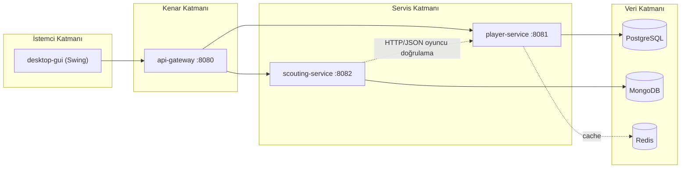
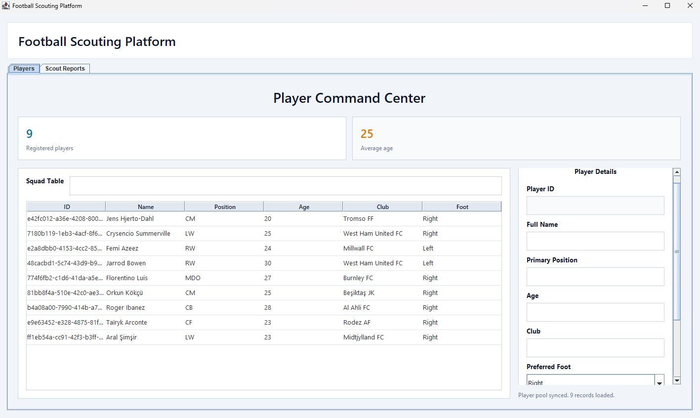
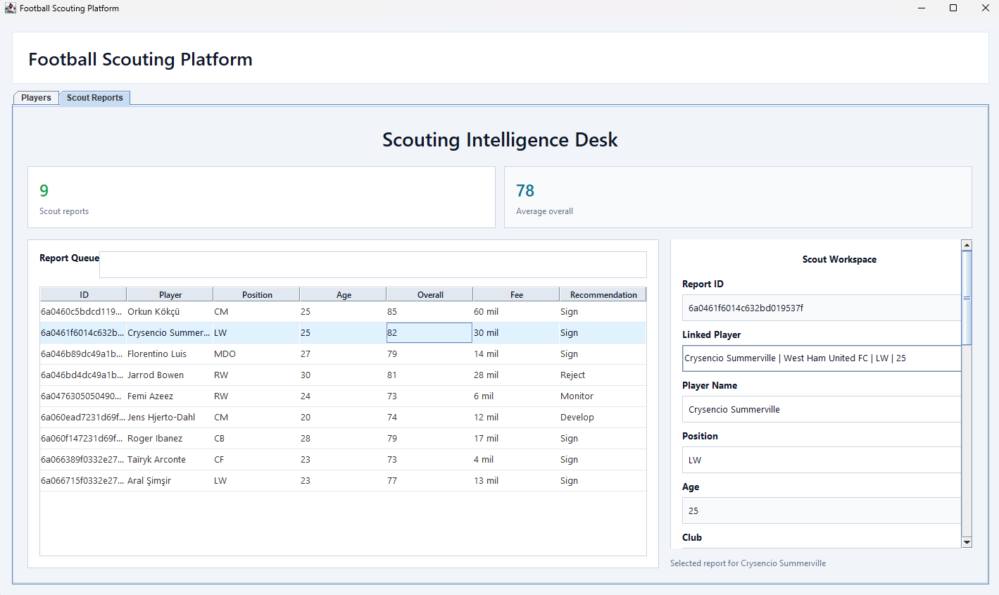
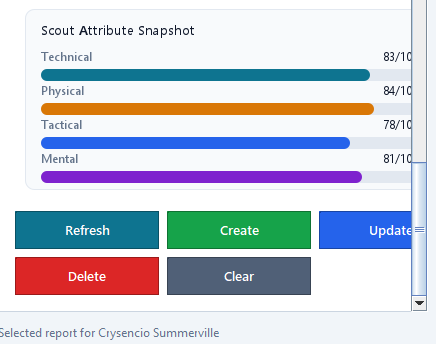
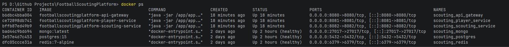
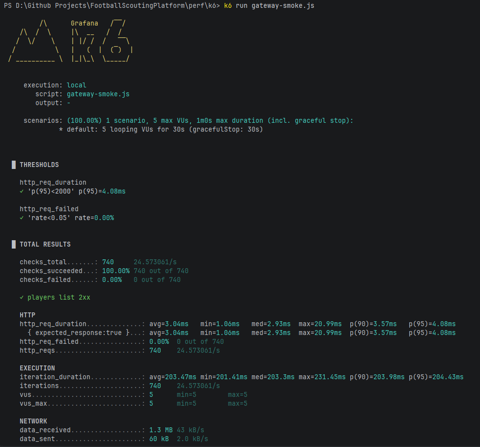
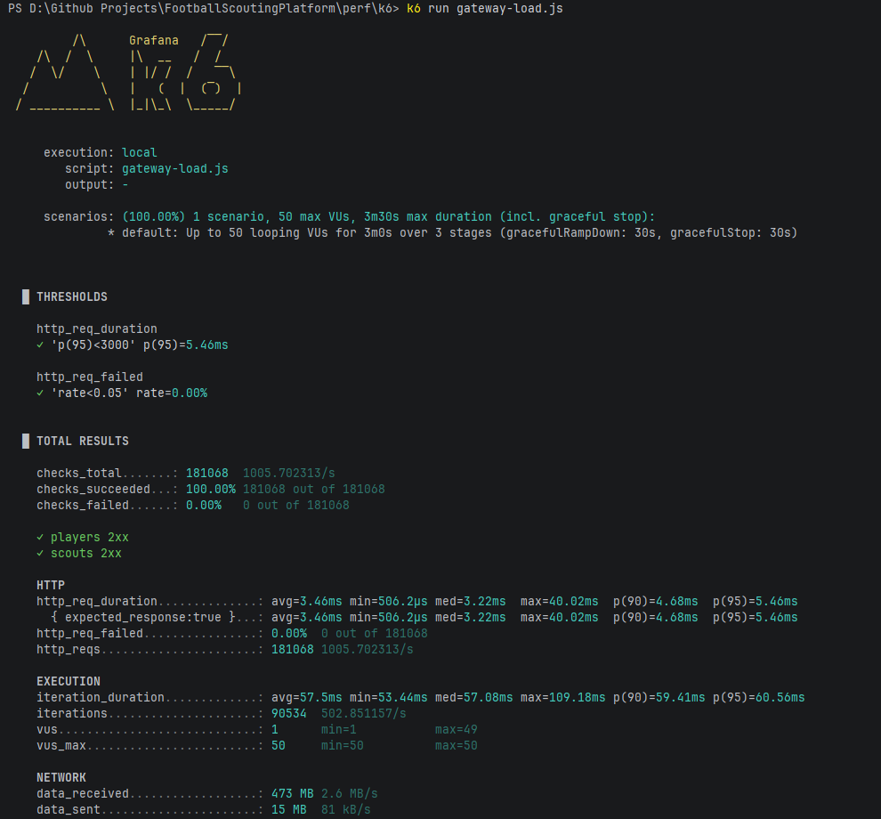
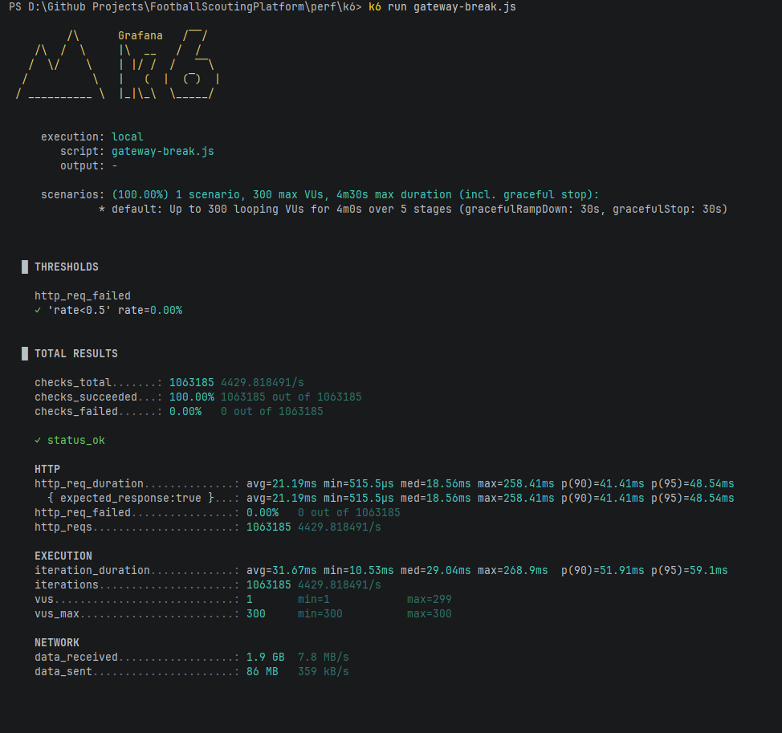

# Football Scouting Platform 

## 1. Proje Kimliği
### Ders: İleri Java Uygulamaları
### Ekip Üyeleri:
- Talha Fırat Meşe - 231307029
- Emre Geyikçioğlu - 231307079

## 2. Projenin Amacı

Football Scouting Platform, futbolcu verilerinin merkezi biçimde yönetildiği ve bu oyuncular için teknik, fiziksel, taktiksel ve mental değerlendirmelere dayalı scout raporlarının üretildiği Java tabanlı bir uygulamadır. Projenin temel amacı, futbol operasyonlarında sık görülen iki ihtiyacı tek platformda toplamaktır:

1. Oyuncu verisini düzenli ve sorgulanabilir biçimde yönetmek
2. Oyuncu hakkında karar verilebilir scout raporları üretmek

## 3. Kapsam ve Kullanıcı Senaryosu

Sistem iki temel iş akışı etrafında şekillenir:

1. Kullanıcı oyuncu kaydı oluşturur, listeler, günceller ve siler.
2. Kullanıcı bir oyuncuya bağlı scout raporu oluşturur, oyuncunun attributelarını girer ve kulübe öneride bulunur (sign-reject vb.).

## 4. Mimari Yaklaşım

Proje  mikroservis yaklaşımıyla kurgulanmıştır. Bunun temel sebebi, oyuncu yönetimi ile scout raporu yönetimini iş sorumluluklarına göre ayırmak ve her veri modelini kendi servisinde bağımsız yaşatabilmektir.

### 4.1 Modüller

| Modül | Rol |
|------|-----|
| `api-gateway` | Dış dünyadan gelen istekleri servis bazlı yönlendirir |
| `player-service` | Oyuncu verisinin iş mantığını ve kalıcılığını yönetir |
| `scouting-service` | Scout raporlarının iş mantığını ve kalıcılığını yönetir |
| `desktop-gui` | Kullanıcıya masaüstü arayüz sağlar |
| `common` | Ortak generic veri modellerini barındırır |
| `perf/k6` | Performans testi scriptlerini içerir |

### 4.2 Mimari Gerekçe

- Oyuncu ve scout raporu farklı yaşam döngülerine sahip olduğu için ayrı servislerde ele alınmıştır.
- API Gateway ile istemcinin servis adreslerini bilmesi engellenmiştir.
- Oyuncu tarafında ilişkisel model, scout tarafında belge tabanlı model daha doğal olduğu için farklı veri depoları tercih edilmiştir.
- Redis kullanımı, özellikle oyuncu listesi gibi sık okunan veriler için cache katmanı ekleme örneği sunar.

## 5. Projeyi Teknik Olarak Nasıl Kurguladık?

### 5.1 API katmanı

Oyuncu tarafında `PlayerController`, scout tarafında `ScoutReportController` bulunur. Controller sınıfları yalnızca HTTP isteklerini karşılar, request validasyonu uygular ve işi service katmanına devreder.

Bu tasarım sayesinde HTTP dünyası ile iş mantığı ayrılmıştır.

### 5.2 İş mantığı katmanı

İş mantığı service sınıflarında toplanmıştır:

- `PlayerService`, oyuncu yaşam döngüsünü ve cache invalidation sürecini yönetir.
- `ScoutReportService`, potansiyel skor hesaplamasını yapar ve oyuncu bilgisini bağlı servisten doğrular.

### 5.3 Veri erişim katmanı

Projede veri erişimi tek teknolojiye bağımlı bırakılmamıştır:

- Oyuncu kaydı: JPA/repository yapısı
- Oyuncu listeleme için JDBC: `JdbcTemplatePlayerQueryAdapter`
- Scout raporları: MongoDB document modeli
- Cache: Redis adapterı

### 5.4 Servisler arası entegrasyon

Scout raporu bir oyuncuya bağlıysa, `scouting-service` oyuncu bilgisini doğrudan kullanıcının gönderdiği metinden değil, veri tutarlılığı için `player-service` üzerinden doğrulamaya çalışır.

Bu sayede bağlı oyuncu senaryosunda kaynak veri `player-service` olur; manuel alanların hatalı veya manipüle edilmiş gelmesi engellenir.

## 6. SOLID ve OOP

### 6.1 Single Responsibility Principle

Her sınıfın ana sorumluluğu mümkün olduğunca dar tutulmuştur:

- `PlayerController` HTTP isteklerini yönetir, iş kuralı içermez.
- `PlayerService` iş akışını yönetir, HTTP veya SQL detayına girmez.
- `JdbcTemplatePlayerQueryAdapter` yalnızca JDBC sorgusundan sorumludur.
- `RedisPlayerListCacheAdapter` yalnızca cache işlemlerini üstlenir.
- `GlobalExceptionHandler` yalnızca hata-response eşlemesini yapar.

### 6.2 Open/Closed Principle

Mevcut davranış, ana servis sınıflarını bozmak zorunda kalmadan yeni adapterlarla genişletilebilmektedir. Önreğin:

- Uygulama katmanı `PlayerListCachePort` arayüzünü bilir.
- Gerçek ortamda `RedisPlayerListCacheAdapter` kullanılabilir.
- Test veya cache istemeyen senaryoda `NoOpPlayerListCacheAdapter` kullanılabilir.

Yani yeni bir cache stratejisi eklemek için `PlayerService` sınıfını yeniden yazmak gerekmez.

### 6.3 Liskov Substitution Principle

Arayüz üzerinden kullanılan somut sınıflar, birbirlerinin yerine geçebilecek biçimde tasarlanmıştır:

- `PlayerListCachePort` için `RedisPlayerListCacheAdapter` ve `NoOpPlayerListCacheAdapter`
- `PlayerLookupPort` için HTTP adapterı ve test stub'ı
- `PlayerRepository` ve `ScoutReportRepository` için test içi in-memory implementasyonlar

### 6.4 Interface Segregation Principle

Arayüzler büyük ve her şeyi kapsayan yapılara dönüştürülmemiştir. Örneğin:

- `PlayerJdbcQueryPort` yalnızca JDBC sorgu ihtiyacını taşır.
- `PlayerListCachePort` yalnızca cache sözleşmesini taşır.
- `PlayerLookupPort` yalnızca oyuncu lookup ihtiyacını tanımlar.

Bu sayede sınıflar ihtiyaç duymadıkları metodlara bağımlı kalmaz.

### 6.5 Dependency Inversion Principle

Service katmanı altyapı sınıflarına değil soyutlamalara bağımlıdır:

- `PlayerService`, `PlayerRepository`, `PlayerListCachePort`, `PlayerJdbcQueryPort` alır.
- `ScoutReportService`, `ScoutReportRepository` ve `PlayerLookupPort` alır.

### 6.6 OOP

Projede OOP yalnızca sınıf kullanımı düzeyinde değil, davranış ve veri bütünlüğü açısından da görülmektedir:

- Encapsulation: `Player` içinde `update`, `normalizeClub`, `normalizePreferredFoot` ile veri normalizasyonu nesnenin içinde tutulur.
- Abstraction: repository ve port arayüzleri.
- Composition over inheritance: davranışın çoğu interface + adapter kompozisyonuyla kurulmuştur.
- Builder Pattern: `ScoutReport.builder()` çok alanlı nesne oluşturmayı okunabilir kılar.
-
## 7. Generic Yapıların Kullanımı

Generic kullanım response modelini standartlaştırmak için kullanılmıştır.

- `PagedResult<T>` her tür listeyi tip güvenli biçimde taşır.
- `PageInfo` sayfalama bilgisini ayrı bir değer nesnesi olarak tutar.
- Controller katmanı bu yapıyı hem oyuncu hem scout listelerinde yeniden kullanır.

## 8. GUI ve Custom Graphics Analizi

Projenin masaüstü arayüzü `MainFrame` içinde iki sekmeli bir operasyon arayüzü kurulmuştur:

- Oyuncu yönetim alanı
- Scout raporu yönetim alanı

### 8.1 Oyuncu ekranı

`PlayerPanel` içinde:

- tablo bazlı listeleme
- arama filtresi
- oyuncu sayısı ve yaş ortalaması metrikleri
- detay formu
- CRUD butonları

bulunmaktadır.

### 8.2 Scout ekranı

`ScoutReportPanel` içinde:

- rapor tablosu
- arama ve sıralama
- linked player seçimi
- puan giriş alanları
- ortalama overall metriği
- özet görsel paneli

bulunmaktadır.

### 8.3 Custom graphics

Custom graphics,  `PotentialScoreBarPanel` ile karşılanmaktadır. Bu sınıf, skor alanını dinleyip yüzde değeri hesaplar ve çubuğu `paintComponent(Graphics)` ile kendisi çizer.

## 9. Hata Yönetimi ve Veri Doğrulama

Her iki serviste de request doğrulama ve hata eşleme katmanı bulunmaktadır.

### 9.1 Request validation

Oyuncu oluşturma ve güncelleme isteklerinde:

- isim boş geçilemez
- pozisyon boş geçilemez
- yaş 13 ile 45 arasında olmalıdır
- preferredFoot yalnızca `Left`, `Right`, `Both` olabilir

Scout raporu isteklerinde:

- `playerId` varsa UUID formatında olmalıdır
- puanlar 1 ile 100 arasında olmalıdır
- expectedFee negatif olamaz
- recommendation ve notes boş geçilemez

### 9.2 Exception mapping

Oyuncu servisinde:

- 404: kayıt bulunamadı
- 400: invalid body veya invalid path variable
- 500: beklenmeyen hata

Scout servisinde bunlara ek olarak:

- 404: linked player bulunamadı
- 502: player-service entegrasyon hatası

## 10. Test Analizi

### 10.1 Mevcut otomatik test durumu

`./mvnw.cmd test` komutu çalıştırılmıştır ve sonuç `BUILD SUCCESS` olmuştur.

Özet:

| Metrik | Sonuç |
|-------|-------|
| Toplam çalıştırılan test | 47 |
| Failure | 0 |
| Error | 0 |
| Skipped | 2 |
| Genel durum | Başarılı |

Modül bazlı dağılım:

| Modül | Test durumu |
|------|-------------|
| `api-gateway` | 4 test geçti |
| `player-service` | 17 test, 1 skip |
| `scouting-service` | 26 test, 1 skip |

### 10.2 Mevcut testler neleri doğrular

#### Application/service seviyesi testler

`PlayerServiceTest` içinde:

- oyuncu oluşturma
- oyuncu bulma
- bulunamayan oyuncuda hata fırlatma
- tüm oyuncuları getirme
- JDBC üzerinden tüm oyuncuları getirme
- güncelleme
- silme

Referanslar:

`ScoutReportServiceTest` içinde:

- rapor oluşturma
- güncelleme
- silme
- listeleme
- linked player varsa authoritative veriyi kullanma
- linked player yoksa hata verme
- linked player yoksa manuel alanları koruma

#### Controller/API seviyesi testler

`PlayerControllerTest` içinde:

- başarılı create
- başarılı get by id
- invalid UUID path durumunda 400
- not found durumunda 404
- JDBC endpoint doğrulaması
- invalid request body durumunda 400

`ScoutReportControllerTest` içinde:

- başarılı create/update/delete
- invalid playerId durumunda 400
- unknown linked player durumunda 404
- player-service lookup fail durumunda 502

## 11. Sistem ve Performans Testleri

Projemizin test süreci dört ana koldan yürütülmektedir: Birim (Unit) Testleri, Arayüz (GUI) Uçtan Uca Testleri, Docker Ortam Doğrulaması ve k6 ile Performans Testleri.

### 11.1 Birim ve Entegrasyon Testleri (Spring Boot)

Backend servislerinin iş mantığı ve HTTP endpoint'leri Spring Boot test altyapısı (JUnit 5 & MockMvc) ile otomatik olarak test edilmektedir.

| Test Grubu | Kapsam | Sonuç |
|-----------|-------|-------|
| **Unit Testler (Servis Katmanı)** | Servislerin iş kuralları (Örn: Potansiyel hesaplama, cache entegrasyonu, validation) | Başarılı (47/47) |
| **API Testleri (Controller Katmanı)** | Endpoint yanıtları, hata durumları (400, 404, 502) ve JSON mapping | Başarılı |

Test için komut: ./mvnw.cmd test . MockMvc ile postman vb. kullanmadan arkaplanda sahte bir http sunucusu simüle ederek testleri tamamlayabiliyoruzç.

### 11.2 Masaüstü Uygulaması (GUI) Manuel Uçtan Uca Testleri

Kullanıcı deneyiminin doğru çalıştığından emin olmak için masaüstü uygulaması (Swing GUI) üzerinden temel iş akışları test edilmiştir.

| Test Senaryosu | Beklenen Durum                                                                                             | Gerçekleşen |
|--------|------------------------------------------------------------------------------------------------------------|-----------|
| **Kayıt Ekleme** | Yeni eklenen futbolcu listeye yansımalı ve veritabanına işlenmelidir.                                      | BAŞARILI |
| **GUI Validasyonları** | Yaş 13-45 arası girilmezse veya boş alan bırakılırsa GUI uyarı vermelidir.                                 | BAŞARILI |
| **Scout Raporu Bağlama** | Bir oyuncuya scout raporu yazıldığında, sistem oyuncuyu otomatik olarak Player Service'ten doğrulamalıdır. | BAŞARILI |
| **Görsel Skor (Custom Graphics)** | Scout yetenek puanları girildikçe "Potential Score" barı grafiksel olarak güncellenmelidir.                | BAŞARILI |

### 11.3 Docker Ortam Doğrulaması

Projenin mikroservis yapısının container ortamında (PostgreSQL, MongoDB, Redis, Gateway, ve Servisler) birbirleriyle haberleşebildiği doğrulanmıştır.

| Doğrulama Adımı | Kontrol Noktası | Sonuç |
|-----|----------------|--------------|
| **Docker Compose Up** | Tüm container'ların eksiksiz ve `Running` veya `Healthy` state'e geçmesi | [BAŞARILI] |
| **API Gateway Erişimi** | `http://localhost:8080/api/players` üzerinden oyuncu listesinin dönebilmesi | [BAŞARILI] |

### 11.4 Performans ve Yük Testleri (k6)

Sistemin yük altındaki kararlılığını ölçmek için API Gateway üzerinden k6 testleri koşulmuştur.
**Testleri Çalıştırma Adımları:**

- cd perf/k6
- k6 run gateway-smoke.js (smoke test)
- k6 run gateway-load.js (load test)
- k6 run gateway-break.js (break test)

**Test Ortamı:** `[16GB RAM, Ryzen 5 3600]`

**1. Smoke Test **
*Amaç: Sistemin temel yanıt verebilirliğini kontrol etmek.*
* **Sanal Kullanıcı (VU):** 5
* **Süre:** 30 saniye
* **Sonuç (Başarı Oranı):** `%100`
* **Ortalama Yanıt Süresi:** `3.04ms  `
* **p(95) Yanıt Süresi:** `4.08ms`

**2. Load Test (gateway-load.js)**
*Amaç: Beklenen normal kullanıcı trafiğinde sistemin performansını ölçmek.*
* **Sanal Kullanıcı (VU):** 0 → 20 (30s) → 50 sabit (2dk) → 0 (30s)
* **Toplam Süre:** ~3 dakika
* **Sonuç (Başarı Oranı):** `%100`
* **Ortalama Yanıt Süresi:** `3.46ms`
* **p(95) Yanıt Süresi:** `5.46ms`
* **Threshold (p95 < 3000ms):** `[Geçti ]`

**3. Break Test / Stress Test (gateway-break.js)**
*Amaç: Sistemin ne kadar yükte kırıldığını veya yavaşladığını gözlemlemek.*
* **Sanal Kullanıcı Kademesi:** 0 → 50 → 100 → 200 → 300 → 0 (toplam ~4 dakika)
* **Maksimum VU:** 300
* **Toplam İstek:** 1.063.185 istek (~4430 istek/saniye)
* **Gözlemlenen Hata Oranı:** `%0.00` — Threshold ✓ (rate < 0.5)
* **Ortalama Yanıt Süresi:** `21.19ms`
* **p(95) Yanıt Süresi:** `48.54ms`
* **Maksimum Yanıt Süresi:** `258.41ms`
* **Kırılma / Yavaşlama Noktası:** Sistem 300 VU altında kırılma noktasına ulaşmadı. Tüm istekler başarıyla yanıtlandı (%100 başarı). Yanıt süreleri yük arttıkça doğrusal biçimde yükseldi (max 258ms) ancak kabul edilebilir sınırlar içinde kaldı.

## 12. Performans Test Altyapısı Analizi

Projede üç ayrı k6 senaryosu hazırdır:

- `gateway-smoke.js`: sistemin temel erişilebilirliğini hızlı doğrular
- `gateway-load.js`: kontrollü kullanıcı yükünde süre ve hata metriklerini ölçer
- `gateway-break.js`: artan yük altında limit davranışını gözlemlemeyi amaçlar

## 13. Dockerize Sistem Kanıtı

docker-compose.yml içinde yalnızca veritabanları değil, uygulama servisleri de tanımlanmıştır:

- postgres-db
- mongo-db
- redis
- player-service
- scouting-service
- api-gateway

## 14 TDD İçin Commit Geçmişi

Projede TDD yaklaşımıyla RED aşamasında önce başarısız test yazılmış, GREEN aşamasında testi geçirecek implementasyon eklenmiş, REFACTOR aşamasında ise kod temizlenmiştir.

-d6bada5  (TDD RED)      oyuncu create-get akışları için ilk testler eklendi
-03d1435  (TDD GREEN)    oyuncu create-get akışları için minimum implementasyonlar eklendi
-264aed2  (TDD REFACTOR) PlayerService içinde oyuncu oluşturma işi yardımcı metoda ayrıldı.
-c664f34  (TDD RED)      player ve scouting servisleri için CRUD, validation ve hata senaryosu testleri eklendi
-7df136c  (TDD GREEN)    player için JPA, scouting için MongoDB tabanlı CRUD implementasyonları eklendi
                         ve testler geçirilir hale getirildi
-b9cad44  (TDD REFACTOR) context testleri dış bağımlılık gerektirmeyecek şekilde düzenlendi
                         + api gateway yönlendirme filtresi eklendi ve api servis rotaları düzeltildi
-e8581f4  TDD            ScoutReport API için playerId doğrulama senaryolarına MockMvc testleri eklendi
-7d25d74  (TDD RED)      gateway için cors ve güvenlik başlığı davranış testleri eklendi
-c031c02  (TDD GREEN)    gateway CORS pattern ayrıştırması testleri geçecek şekilde düzeltildi
-f29e211  (TDD RED)      scouting-service player lookup adapter hata ve response senaryoları eklendi
-cb115f3  (TDD GREEN)    player service http lookup adapter, enjekte edilebilir constructor eklenerek
                         testleri geçecek şekilde düzenlendi

## 15. Sonuç

Football Scouting Platform, mikroservis mimarisi, API Gateway, çoklu veri teknolojisi (PostgreSQL, MongoDB, Redis), masaüstü GUI, custom graphics, SOLID/OOP, generic yapılar, kapsamlı hata yönetimi, TDD döngüsü ve k6 performans testleri ile ders isterlerini teknik derinlikte karşılayan bir projedir. Tüm bileşenler Docker üzerinde tek komutla ayağa kaldırılabilmekte; otomatik testler, manuel GUI testleri ve yük testleri ile sistemin doğruluğu ve kararlılığı kanıtlanmıştır.
