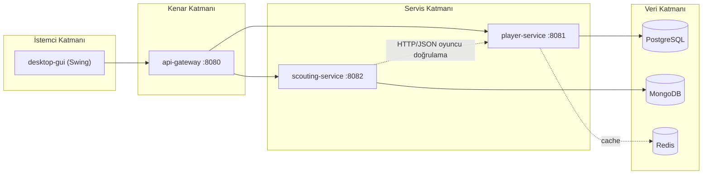

# Football Scouting Platform 

## 1. Proje Kimliği
### Ders: İleri Java Uygulamaları
### Ekip Üyeleri:
- Talha Fırat Meşe - 231307029
- Emre Geyikçioğlu - 231307079

## 2. Projenin Amacı

Football Scouting Platform, futbolcu verilerinin merkezi biçimde yönetildiği ve bu oyuncular için teknik, fiziksel, taktiksel ve mental değerlendirmelere dayalı scout raporlarının üretildiği Java tabanlı bir uygulamadır. Projenin temel amacı, futbol operasyonlarında sık görülen iki ihtiyacı tek platformda toplamaktır:

1. Oyuncu verisini düzenli ve sorgulanabilir biçimde yönetmek
2. Oyuncu hakkında karar verilebilir scout raporları üretmek

## 3. Kapsam ve Kullanıcı Senaryosu

Sistem iki temel iş akışı etrafında şekillenir:

1. Kullanıcı oyuncu kaydı oluşturur, listeler, günceller ve siler.
2. Kullanıcı bir oyuncuya bağlı scout raporu oluşturur, oyuncunun attributelarını girer ve kulübe öneride bulunur (sign-reject vb.).

## 4. Mimari Yaklaşım

Proje  mikroservis yaklaşımıyla kurgulanmıştır. Bunun temel sebebi, oyuncu yönetimi ile scout raporu yönetimini iş sorumluluklarına göre ayırmak ve her veri modelini kendi servisinde bağımsız yaşatabilmektir.

