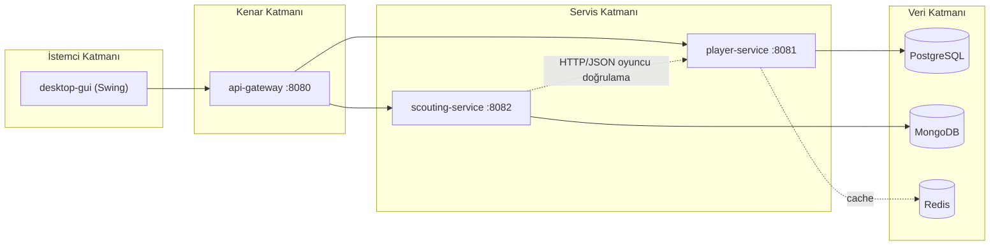

# Football Scouting Platform 

## 1. Proje Kimliği
### Ders: İleri Java Uygulamaları
### Ekip Üyeleri:
- Talha Fırat Meşe - 231307029
- Emre Geyikçioğlu - 231307079

## 2. Projenin Amacı

Football Scouting Platform, futbolcu verilerinin merkezi biçimde yönetildiği ve bu oyuncular için teknik, fiziksel, taktiksel ve mental değerlendirmelere dayalı scout raporlarının üretildiği Java tabanlı bir uygulamadır. Projenin temel amacı, futbol operasyonlarında sık görülen iki ihtiyacı tek platformda toplamaktır:

1. Oyuncu verisini düzenli ve sorgulanabilir biçimde yönetmek
2. Oyuncu hakkında karar verilebilir scout raporları üretmek

## 3. Kapsam ve Kullanıcı Senaryosu

Sistem iki temel iş akışı etrafında şekillenir:

1. Kullanıcı oyuncu kaydı oluşturur, listeler, günceller ve siler.
2. Kullanıcı bir oyuncuya bağlı scout raporu oluşturur, oyuncunun attributelarını girer ve kulübe öneride bulunur (sign-reject vb.).

## 4. Mimari Yaklaşım

Proje  mikroservis yaklaşımıyla kurgulanmıştır. Bunun temel sebebi, oyuncu yönetimi ile scout raporu yönetimini iş sorumluluklarına göre ayırmak ve her veri modelini kendi servisinde bağımsız yaşatabilmektir.

### 4.1 Modüller

| Modül | Rol |
|------|-----|
| `api-gateway` | Dış dünyadan gelen istekleri servis bazlı yönlendirir |
| `player-service` | Oyuncu verisinin iş mantığını ve kalıcılığını yönetir |
| `scouting-service` | Scout raporlarının iş mantığını ve kalıcılığını yönetir |
| `desktop-gui` | Kullanıcıya masaüstü arayüz sağlar |
| `common` | Ortak generic veri modellerini barındırır |
| `perf/k6` | Performans testi scriptlerini içerir |

### 4.2 Mimari Gerekçe

- Oyuncu ve scout raporu farklı yaşam döngülerine sahip olduğu için ayrı servislerde ele alınmıştır.
- API Gateway ile istemcinin servis adreslerini bilmesi engellenmiştir.
- Oyuncu tarafında ilişkisel model, scout tarafında belge tabanlı model daha doğal olduğu için farklı veri depoları tercih edilmiştir.
- Redis kullanımı, özellikle oyuncu listesi gibi sık okunan veriler için cache katmanı ekleme örneği sunar.

## 5. Projeyi Teknik Olarak Nasıl Kurguladık?

### 5.1 API katmanı

Oyuncu tarafında `PlayerController`, scout tarafında `ScoutReportController` bulunur. Controller sınıfları yalnızca HTTP isteklerini karşılar, request validasyonu uygular ve işi service katmanına devreder.

Bu tasarım sayesinde HTTP dünyası ile iş mantığı ayrılmıştır.

### 5.2 İş mantığı katmanı

İş mantığı service sınıflarında toplanmıştır:

- `PlayerService`, oyuncu yaşam döngüsünü ve cache invalidation sürecini yönetir.
- `ScoutReportService`, potansiyel skor hesaplamasını yapar ve oyuncu bilgisini bağlı servisten doğrular.

### 5.3 Veri erişim katmanı

Projede veri erişimi tek teknolojiye bağımlı bırakılmamıştır:

- Oyuncu kaydı: JPA/repository yapısı
- Oyuncu listeleme için JDBC: `JdbcTemplatePlayerQueryAdapter`
- Scout raporları: MongoDB document modeli
- Cache: Redis adapterı

### 5.4 Servisler arası entegrasyon

Scout raporu bir oyuncuya bağlıysa, `scouting-service` oyuncu bilgisini doğrudan kullanıcının gönderdiği metinden değil, veri tutarlılığı için `player-service` üzerinden doğrulamaya çalışır.

Bu sayede bağlı oyuncu senaryosunda kaynak veri `player-service` olur; manuel alanların hatalı veya manipüle edilmiş gelmesi engellenir.

