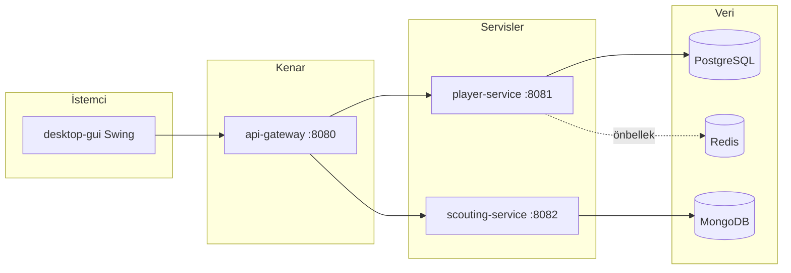

# Football Scouting Platform — TBL324 Teknik Rapor

Bu belge **proje isterleri.pdf** (Kocaeli Üniversitesi TBL324) içindeki **Analiz & Doküman** ve **Performans Testleri** maddeleriyle uyumlu olacak şekilde hazırlanmıştır: proje tanıtımı, Mermaid mimari diyagramı, k6 ile yük ve kırılma testleri, çalıştırma talimatları.

---

## 1. Proje tanıtımı

**Amaç:** Futbol oyuncularını ve keşif (scout) raporlarını yöneten, mikroservis mimarisiyle ayrıştırılmış, Java tabanlı bir platform.

**Bileşenler:**

| Modül | Görev |
|--------|--------|
| `common` | Ortak modeller (`PagedResult<T>`, `PageInfo`) |
| `player-service` | Oyuncu CRUD, PostgreSQL (JPA/JDBC sürücüsü), isteğe bağlı Redis önbellek |
| `scouting-service` | Keşif raporu CRUD, MongoDB |
| `api-gateway` | `/api/**` altında yönlendirme, CORS, güvenlik başlıkları |
| `desktop-gui` | Swing istemcisi; `HttpClient` ile API; özel `paintComponent` grafik bileşeni |

**Teknoloji:** Java 21, Spring Boot 4, Spring Cloud Gateway, Docker Compose.

---

## 2. PDF değerlendirme kriterleri — karşılık tablosu

Aşağıdaki tablo **proje isterleri.pdf** Tablo 1 ile kod/doküman eşlemesidir.

| PDF kriteri | Puan | Bu projede kanıt |
|-------------|------|-------------------|
| API & Back-end | 10 | `player-service`, `scouting-service` REST API |
| Generic yapılar | 10 | `PagedResult<T>`, `ApiResponse<T>`, koleksiyonlarla kullanım |
| Custom GUI + özel grafik | 10 | `desktop-gui` Swing; `PotentialScoreBarPanel.paintComponent` |
| JDBC & NoSQL | 10 | PostgreSQL (JPA üzerinden JDBC); MongoDB; ek olarak Redis |
| SOLID & OOP | 10 | Katmanlı paketler, port/adapter (ör. önbellek), Builder (`ScoutReport`) |
| Hata yönetimi (4xx/5xx) | 5 | `GlobalExceptionHandler` (doğrulama, 404, 400, 500, geçersiz yol parametresi) |
| Performans testleri | 5 | `perf/k6/` — duman, yük, kırılma/stres; bu belgede raporlama |
| Analiz & doküman | 5 | Bu dosya (Markdown + Mermaid); GitHub’da versiyonlanır |

**Ek özellikler (PDF):**

| Ek kriter | Puan | Kanıt |
|-----------|------|--------|
| Mikroservis | +10 | Ayrı servisler, JSON/HTTP |
| Gateway | +5 | `api-gateway` |
| TDD | +10 | `mvn test`, önce test sonra uygulama (Red-Green-Refactor süreci) |
| Dockerize | +5 | `docker-compose.yml`, `app` profili, Dockerfile’lar |

*Not:* Mobil GUI bu teslimde yoktur (isteğe bağlı +5).

---

## 3. Mimari (Mermaid)



---

## 4. Çalıştırma

**Veritabanları + Redis:**

```bash
docker compose up -d
```

**Tüm API’ler (profil `app`):**

```bash
docker compose --profile app up -d --build
```

**Testler:**

```bash
cd player-service
.\mvnw.cmd -f ..\pom.xml clean test
```

---

## 5. Performans testleri (k6)

PDF: API’nin **yük** ve **kırılma** testlerinin yapılması ve **raporlanması**.

| Script | Amaç |
|--------|------|
| `perf/k6/gateway-smoke.js` | Hızlı duman: servis ayakta mı |
| `perf/k6/gateway-load.js` | Yük: iki uç noktaya sürekli trafik |
| `perf/k6/gateway-break.js` | Kırılma/stres: VU rampası ile davranış gözlemi |

**Önkoşul:** Gateway `http://localhost:8080` (veya `BASE_URL` ile doğrudan servis).

```bash
k6 run perf/k6/gateway-smoke.js
k6 run perf/k6/gateway-load.js
k6 run perf/k6/gateway-break.js
```

**Örnek özet dışa aktarma (rapor ekine):**

```bash
k6 run --summary-export=perf/k6/out-load-summary.json perf/k6/gateway-load.js
k6 run --summary-export=perf/k6/out-break-summary.json perf/k6/gateway-break.js
```

Çıktıdaki `http_req_duration`, `http_req_failed` ve `iterations` alanları raporda özetlenir; yük ortamında eşik ihlalleri beklenen stres gözlemi olabilir.

---

## 6. Önemli notlar (PDF ile uyum)

- Tüm ana bileşenler **Java** ile geliştirilmiştir.
- **GitHub:** düzenli commit ve ekip politikası öğrenci sürecine bağlıdır (kod tabanı bunu otomatik doğrulamaz).
- **İntihal / dil:** PDF’deki uyarılar değerlendirme kurallarına tabidir.

---

*Belge sürümü: proje deposu ile birlikte güncellenir.*
